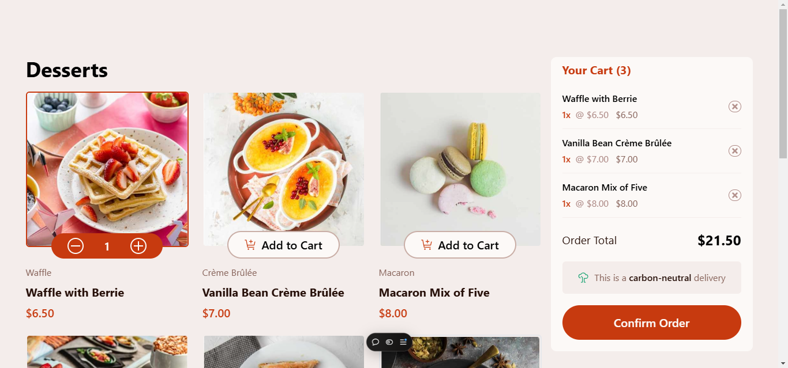

# Frontend Mentor - Product list with cart solution

This is a solution to the [Product list with cart challenge on Frontend Mentor](https://www.frontendmentor.io/challenges/product-list-with-cart-5MmqLVAp_d). Frontend Mentor challenges help you improve your coding skills by building realistic projects.

## Table of contents

- [Overview](#overview)
  - [Screenshot](#screenshot)
  - [Links](#links)
- [My process](#my-process)
  - [Built with](#built-with)
  - [What I learned](#what-i-learned)
  - [Continued development](#continued-development)
  - [Useful resources](#useful-resources)
- [Author](#author)
- [Acknowledgments](#acknowledgments)

## Overview

### Screenshot



### Links

- Solution URL: [Github pages](https://github.com/obed-smart/product-list-with-cart)
- Live Site URL: [Live repo](https://product-list-cart-tau.vercel.app/)

## My process

### What I learned

In this project i learned how to work with tailwind css Abitrary value to add a custom css and to do some tailwind nesting.
i learned how to manage start in tailwind and this is my first complete tailwind css project and i really learned alot from it

in javascript i learn more on Dom manipukationa and some new array method like map , reduce and find with i use to handle the adding the product to cart an many more.

```html
<h1>Some HTML code I'm proud of</h1>
```

<div
    id="product-list"
          class="grid w-full grid-cols-[repeat(auto-fill,_minmax(250px,_1fr))]
           gap-[1.5rem]
            [&>figure>div:nth-child(1)]:w-full
             [&>figure>div:nth-child(1)]:shadow-[0_0_3rem_rgba(0_0_0_1)] 
             [&_*_picture>img]:block
              [&_*_picture>img]:w-full
              [&_*_picture>img]:rounded-md 
              [&_*_picture>img]:border-2
               [&_*_picture>img]:border-transparent
                [&_*_picture>img]:object-cover
                 [&_*_picture>img]:transition-colors
                  [&_*_picture>img]:duration-500"
        ></div>
         <div
                id="Btn-parent"
                class="absolute -bottom-5 left-0 right-0 z-10 mx-auto flex w-fit 
                 [&:has(.card2)>div:nth-child(1)]:hidden
                  [&:has(.card2)>div:nth-child(2)]:flex
                   [&:has(.card2)]:border-0
                    [&:has(.card2)]:bg-red"
              >


```js
const proudOfThisFunc = () => {
  console.log("🎉");
};
```


### Useful resources


## Author


- Twitter - [Obed](https://x.com/eberechukwuobed)

